# Documentation on Web-Stack-Implementation-MERN-STACK-101-108
The MERN stack is a web development framework made up of the stack of MongoDB, Express, React.js, and Node.js. It is one of the several variants of the 
MEAN stack. When we use the MERN stack, you work with React to implement the presentation layer, 
Express and Node.js to make up the middle or application layer, and MongoDB to create the database layer.

## MERN-Stack-101 : EC2 instace and Virtual Ubuntu Server
AWS account was already created in previously done stack project. I have created another EC2 instance for MERN Stack Implentation.

### Created New EC2 instance and Setting up Ubuntu 
- First, created an ec2 instance named it as "Mern-instance" in a region "Stockholm" with instance type "t3.micro", AMI (Amazon Machine Image ) as "ubuntu", at first selected security group having inbound rules for (SSH,HTTP,HTTPS), later on added port 3000 and 5000  and all other required configuration was selected as default here.
 
 
  
 
- Latest version of ubuntu was selected which is "Ubuntu Server 22.04 LTS (HVM)". An AMI is a template that contains the software configuration (operating system, application server, and applications) required to launch your instance.
 
- Private key was generated and named it as : "mern-stack-private" and downloaded ".pem" file.

### Connecting virtual server to EC2 instance
Used the same private key previously downloaded to connect to EC2 instace via ssh :
- Created security group configuration adding ssh and updated this configuration to my ec2 instance to access  TCP port 22.
- Changed the permission for "mern-stack-private.pem" file as :

  ```
  chmod 400 "mern-stack-private.pem"
  ```
- Connected to the instance as
  ```
  ssh -i "mern-stack-private.pem" ubuntu@ec2-16-171-38-244.us-east-2.compute.amazonaws.com
  ```
  This get changes as you stopped the ec2 instance and run again.
  

### Conclusion 
Linux Server in the cloud was created.

## MERN-Stack-102 : Backend configuration and  Installing the Node.js in the server
- Updated and Upgraded ubuntu EC2 instance :
  ```
    sudo apt update
    sudo apt upgrade
  ```
    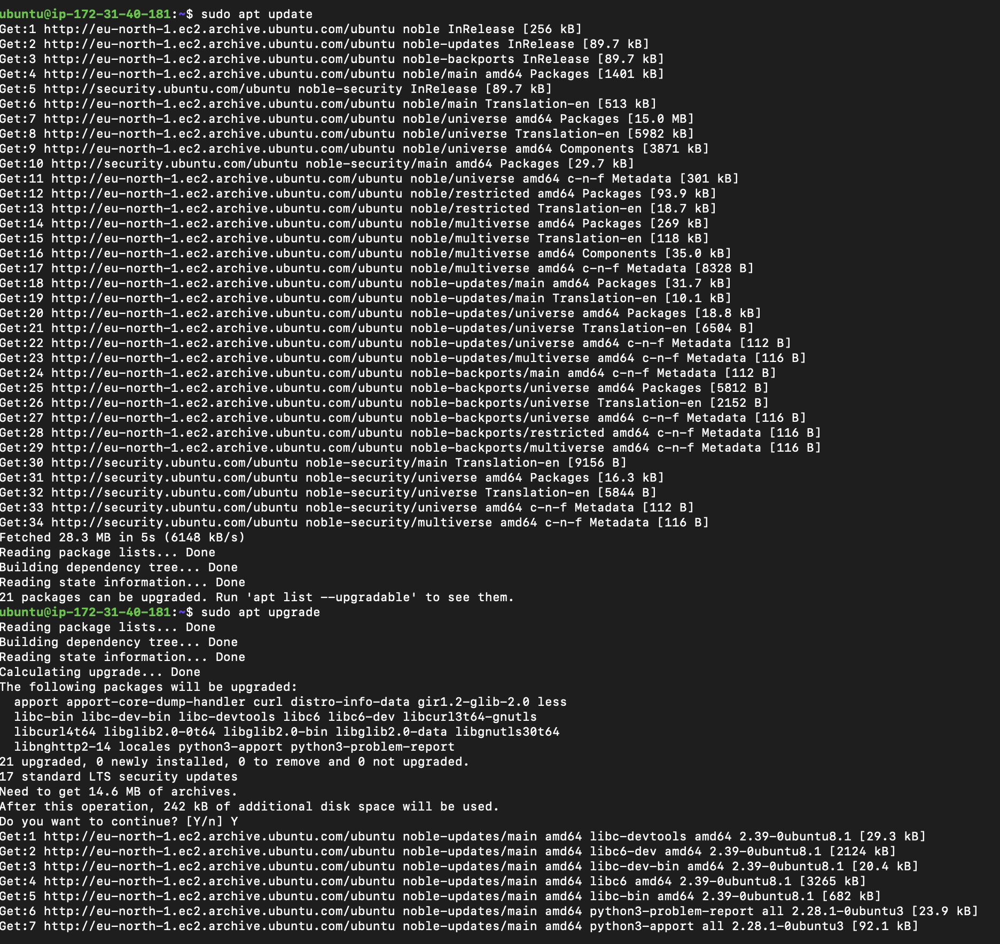
- Got the location of Node.js software from Ubuntu repositiorires :
  ```
    curl -fsSL https://deb.nodesource.com/setup_18.x | sudo -E bash -
  ```
    
    

- Installed Node.js on the server :
  ```
    sudo apt-get install -y nodejs
  ```
Note : The command above install both nodejs and npm. NPM is a package manager for Node, it is used to install Node modules and packages and to manage dependency conflicts.

- Verified node istallation :
  ```
    node -v 
    npm -v
  ```
    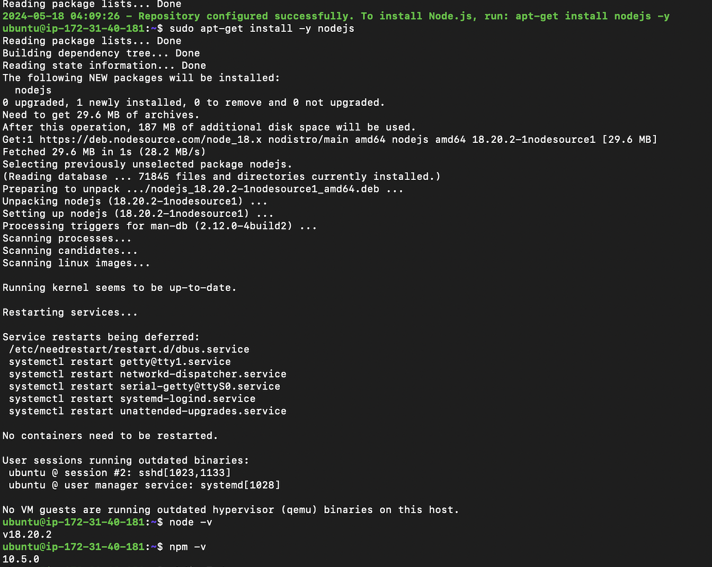
### Appication Code SetUp
- Created a new directory for To-Do project :
  ```
    sudo mkdir
  ```

- Verified that the Todo directory is created :
  ```
    ls
  ```

- Changed current directory to the newly created one :
  ```   
    cd Todo
  ```

- Initialised the project :
  ```
    npm init
  ```
    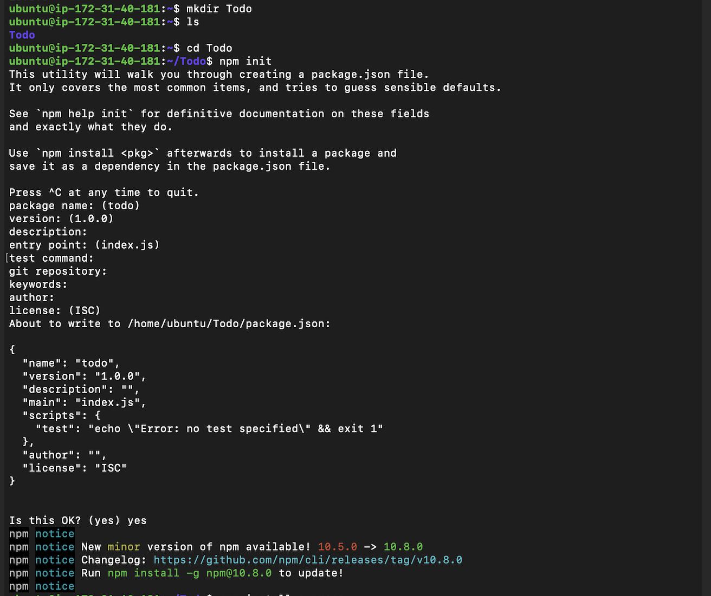
Note : A new file named package.json was created. This file will normally contain information about our application and the dependencies that it needs to run. 
    
### Conclusion

## MERN-Stack-103 : Installig ExpressJs and creating Routes 
Express helps to define routes of our application based on HTTP methods and URLs.
- Installed express using npm :
  ```
    npm install express
  ```

- Created a file index.js :
  ``` 
    touch index.js
  ```
    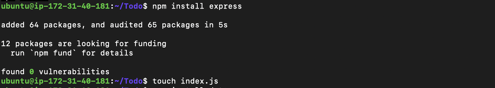
- Installed the dotenv module :
  ```
    npm install dotenv
  ```

- Installed the index.js file and wrote the below given code :
  ```
    vim index.js
  ```
  ```
        const express = require('express');
        require('dotenv').config();
        
        const app = express();
        
        const port = process.env.PORT || 5000;
        
        app.use((req, res, next) => {
        res.header("Access-Control-Allow-Origin", "\*");
        res.header("Access-Control-Allow-Headers", "Origin, X-Requested-With, Content-Type, Accept");
        next();
        });
        
        app.use((req, res, next) => {
        res.send('Welcome to Express');
        });
        
        app.listen(port, () => {
        console.log(`Server running on port ${port}`)
        });
  ```

- Started server to see if it works :
  ```
    node index.js
  ```
    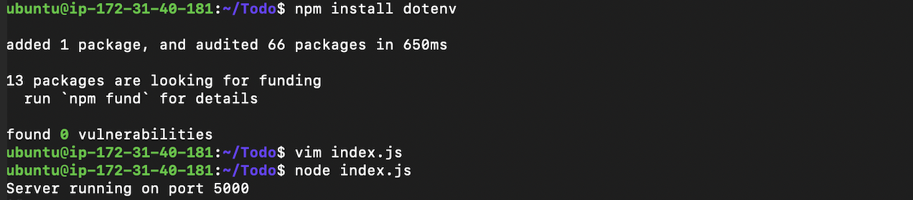
- Accessed the server's public ip address and got output as :
    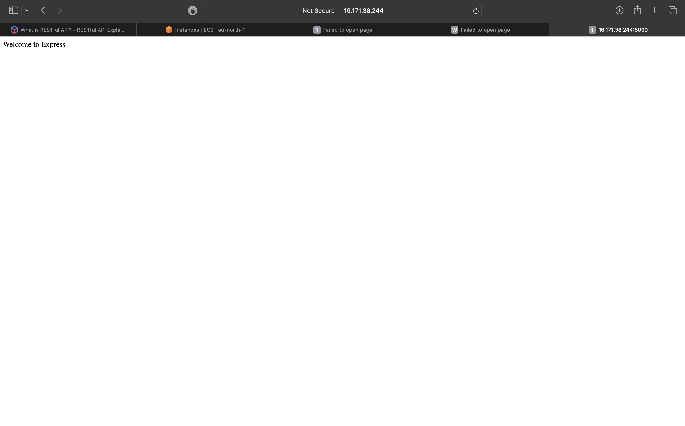

### Routes
There are three actio that our To-Do application needs to be able to do:
 1. Create a new task.
 2. Display list of all tasks.
 3. Delete a completed task.
 Each task will be associated with some particular endpoint and will use different standard HTTP request methods : POST, GET, DELETE.

- Created a folder routes :
  ```
    mkdir routes
  ```

-  Changed directory to routes folder :
  ```
  cd routes
  ```

- Created a file api.js and opened it :
  ```
    touch api.js
    vim api.js
  ```

- Wrote the code into the file api.js :
  ```
               const express = require ('express');
         const router = express.Router();
         
         router.get('/todos', (req, res, next) =&gt; {
         
         });
         
         router.post('/todos', (req, res, next) =&gt; {
         
         });
         
         router.delete('/todos/:id', (req, res, next) =&gt; {
         
         })
         
         module.exports = router;
  ```
    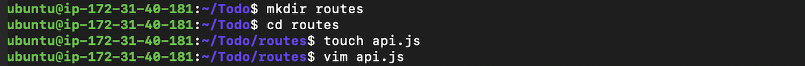

## MERN-Stack-104 : Creating Models directory 
Since, the app was going to make use of Mongodb which is a NoSql database, needed to create a model. A model is the heart of Javascript based applications, and it is what makes it interactive. Used models to define the database schema. This is important so that we will be able to define the fields stored in each Mongodb document. The schema is a blueprint of how the database will bw constructed including other data fields that may not be required to be stored in the database. These are known as virtual properties.

- In Todo directory, installed Mangoose 
  ```
  npm install mangoose
  ```

- Created new folder and changed directory into newly created folder and created a file todo.js :
  ```
    mkdir models && cd models && touch todo.js
  ```

- Opened todo.js and typed the code :
  ```
  vim todo.js
  ```
  ```
        const mongoose = require('mongoose');
        const Schema = mongoose.Schema;
        
        //create schema for todo
        const TodoSchema = new Schema({
        action: {
        type: String,
        required: [true, 'The todo text field is required']
        }
        })
        
        //create model for todo
        const Todo = mongoose.model('todo', TodoSchema);
        
        module.exports = Todo;
  ```

- Updated routes from the file api.js in 'routes' directory to make use of the new model :
  ```
    vim api.js
  ```

  ```
    const express = require('express');
    const router = express.Router();
    const Todo = require('../models/todo');

    router.get('/todos', (req, res, next) => {
    // Retrieve all todos, exposing only the id and action field to the client
    Todo.find({}, 'action')
        .then(data => res.json(data))
        .catch(next)
    });

    router.post('/todos', (req, res, next) => {
    if (req.body.action) {
        Todo.create(req.body)
            .then(data => res.json(data))
            .catch(next)
    } else {
        res.json({
            error: "The input field is empty"
        })
    }
    });


    router.delete('/todos/:id', (req, res, next) => {
    Todo.findOneAndDelete({"_id": req.params.id})
        .then(data => res.json(data))
        .catch(next);
    })

    module.exports = router;
  ```
    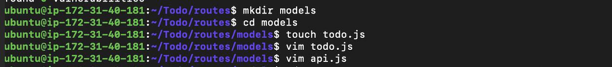

## MERN-Stack-105 : Setting Up MongoDB Database
To store data, needed a database. Created MongoDB databse using mlab :
- Visited https://cloud.mongodb.com/
- Signed up for an account.
- Clicked on Create Cluster button.
- Chose AWS cloud and region closest to me
- Clicked on create cluster.
    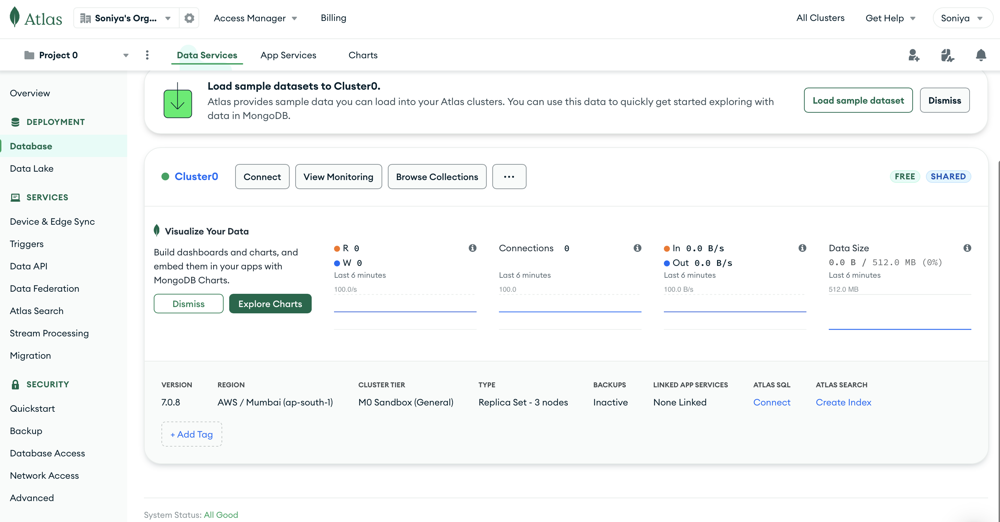
### Configuration :

- Created a Database User:
- Went to the “Database Access” under the “Security” section.
- Clicked on “Add New Database User”.
- Entered a username and password. Ensured the “Read and Write to any database” option is selected.
- Clicked "Add User".
- Went back to cluster page, clicked in connect, select drivers and choose Mongoose , copied the conection url.
    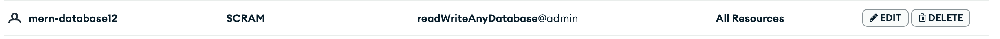
    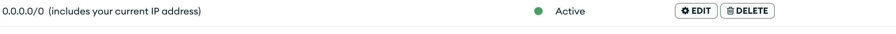

### Connecting the app to MongoDb :
- Created .env file in Todo directory :
  ```
    touch .env
    vi .env
  ```
    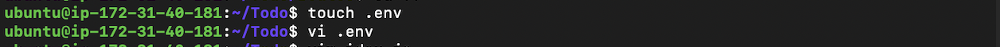
- Added the connection string to access the database in it :
  ```

  ```
- Updated index.js file with the code :
  ```
        const express = require('express');
       const bodyParser = require('body-parser');
       const mongoose = require('mongoose');
       const routes = require('./routes/api');
       const path = require('path');
       require('dotenv').config();
       
       const app = express();
       
       const port = process.env.PORT || 5000;
       
       //connect to the database
      mongoose.connect(process.env.DB)
      .then(() => console.log('Database connected successfully'))
     .catch(err => console.log('Error connecting to MongoDB:', err));

       
       //since mongoose promise is depreciated, we overide it with node's promise
       mongoose.Promise = global.Promise;
       
       app.use((req, res, next) => {
       res.header("Access-Control-Allow-Origin", "\*");
       res.header("Access-Control-Allow-Headers", "Origin, X-Requested-With, Content-Type, Accept");
       next();
       });
       
       app.use(bodyParser.json());
       
       app.use('/api', routes);
       
       app.use((err, req, res, next) =>  {
       console.log(err);
       next();
       });
       
       app.listen(port, () =>  {
       console.log(`Server running on port ${port}`)
       });
  ```
- Started server and get the output as 'Database connected successfully' :
  ```
    node index.js
  ```
    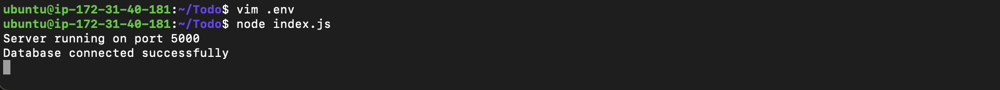
### Conclusion
Backend part of To-do application and database had been configured successfully.

## MERN-Stack-106 : Testing Backend Code Without Frontend using RESTfulAPI
- Used Postman to test our API. 
- Installed Postman in my machine and perform POST, GET and DELETE request to the API :
  ```
    http://<Public-Ip>:5000/api/todos
  ```

- Output :
    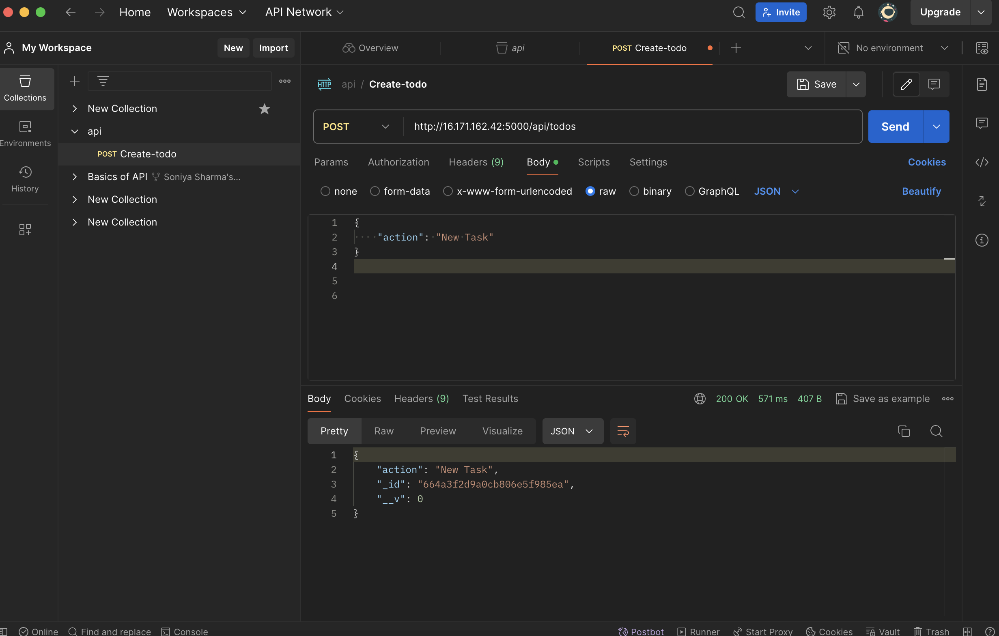
    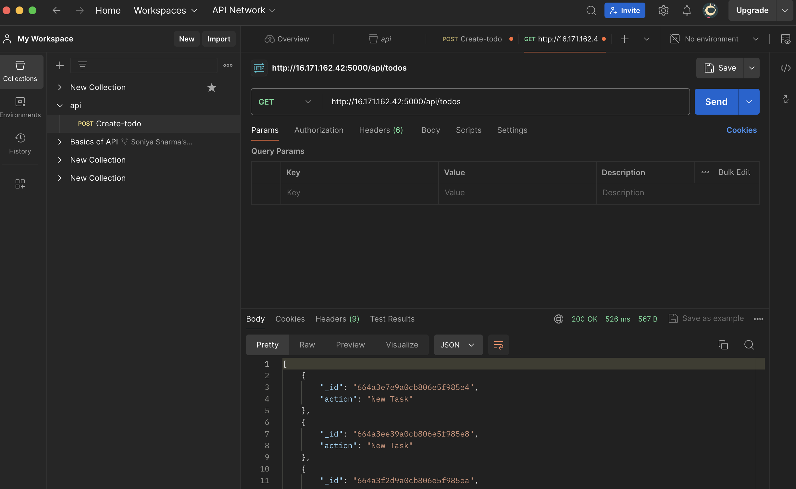
    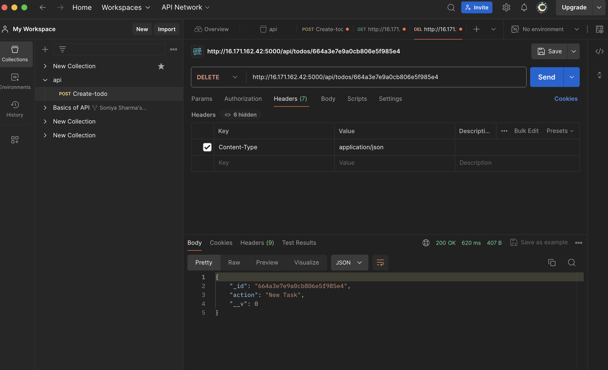

### Conclusion 
Test successful.

## MERN-Stack-107 : Frontend Creation
Functionality from backend and API was done, it was the time to create a user interface for a web client(browser) to interact with application via API.
- Started with forntend of To-do app in Todo directory:
  ```
    npx create-react-app client
  ```
Note : Here, t3.micro didn't give enough storage to install react app in free tier so I switched to t3.small as instance type.
- Installing some dependiences of React App
  ```
    npm install concurrently --save-dev
  ```
  ```
    npm install nodeman --save-dev
  ```
- In Todo folder open the package.json file and updated the file with code :
  ```
    "scripts":{
    "start": "node index.js",
    "start-watch": "nodemon index.js",
    "dev": "concurrently \"npm run start-watch\" \"cd client &amp;&amp; npm start\""
    },
  ```
- Configured proxy in package.json 
  ```
    cd client
  ```
  ```
    vi package.json
  ```
  ```
    "proxy": "http:/localhost:5000"
  ```
- Inside Todo directory :
  ```
    npm run dev
  ```
    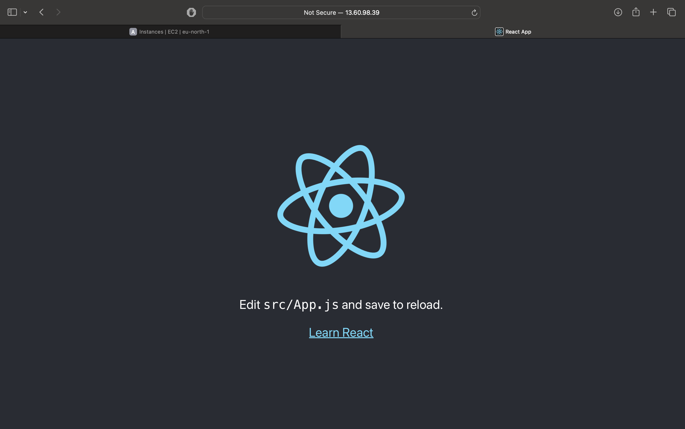


