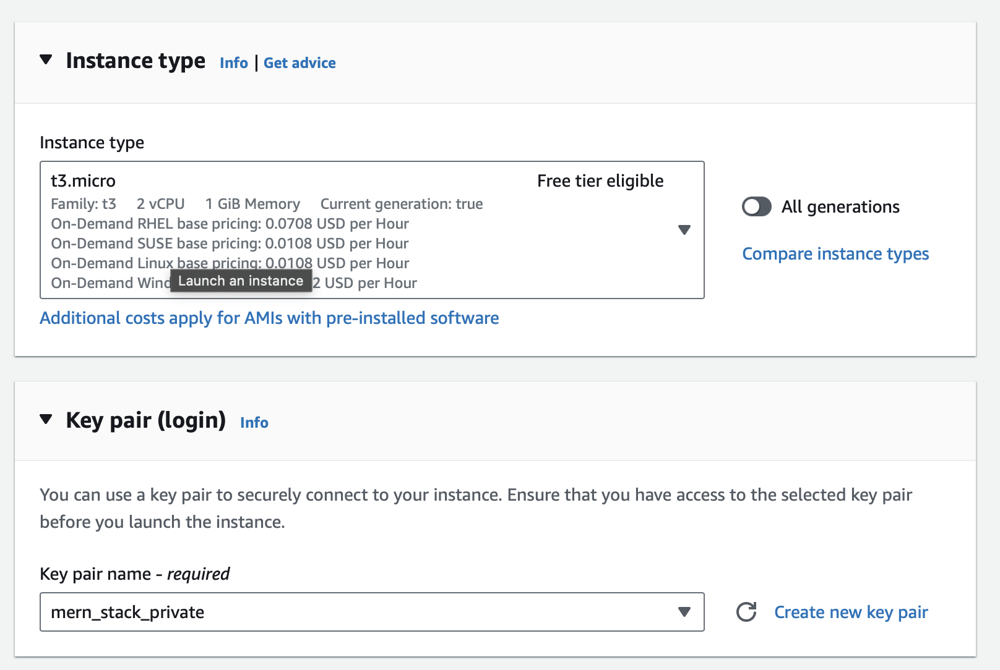
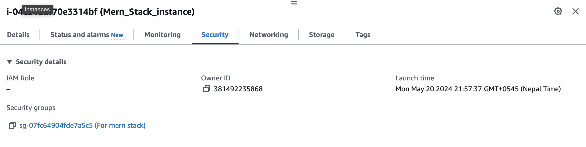
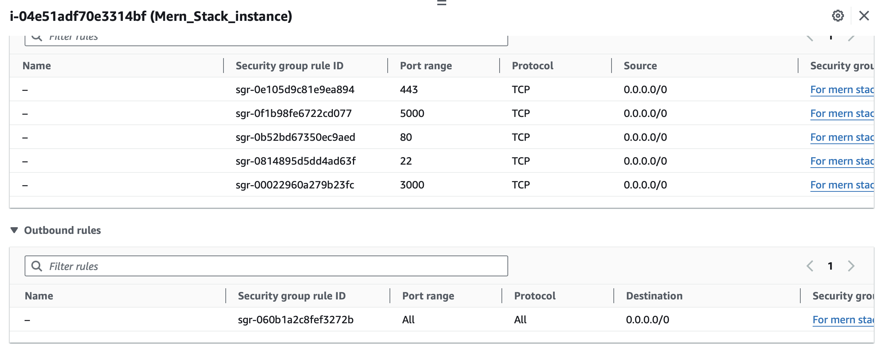
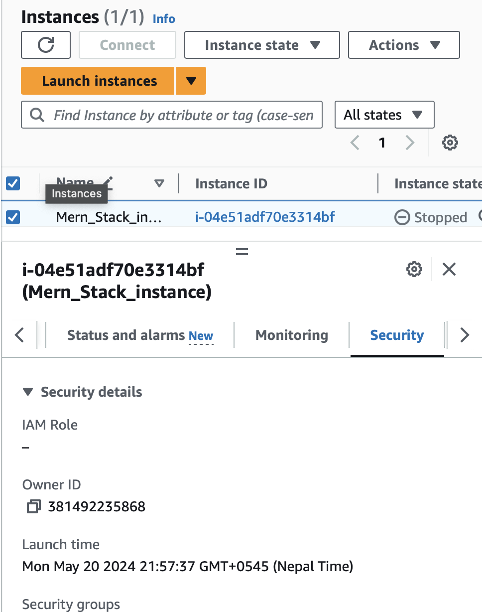
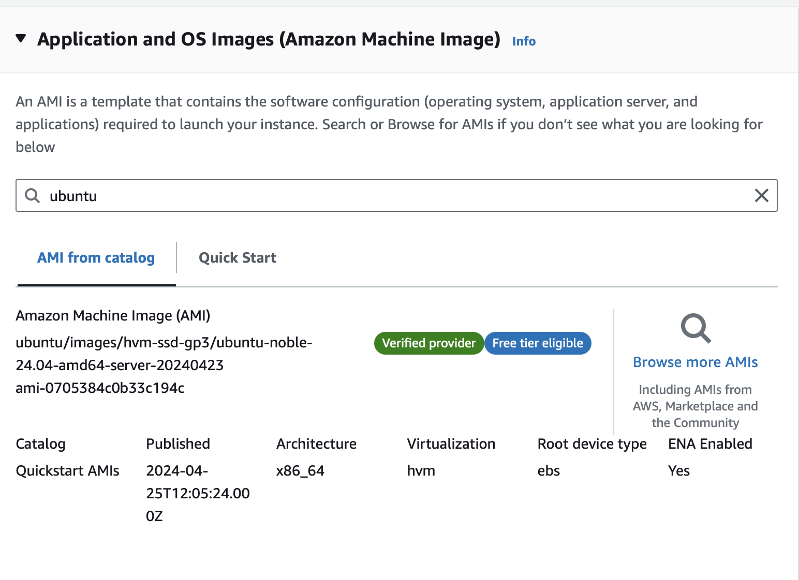
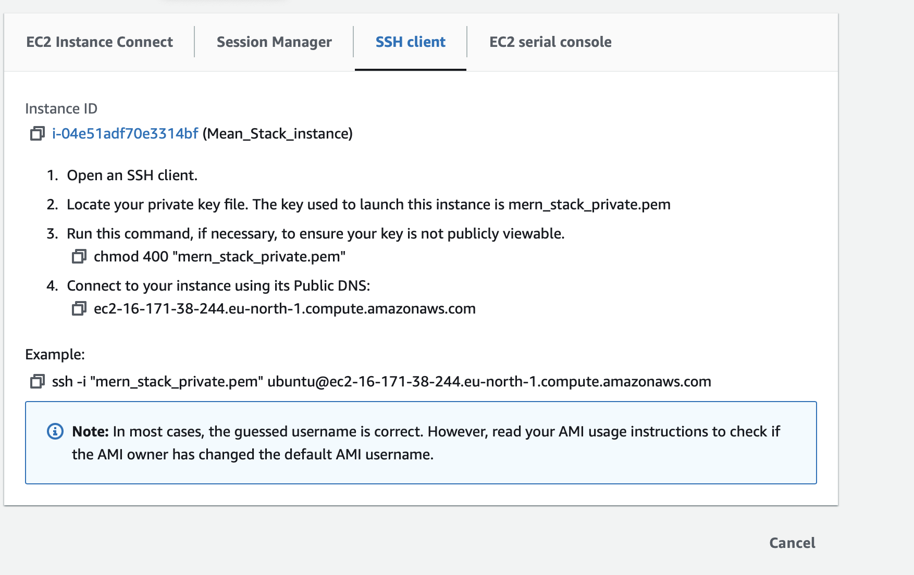

# Documentation on Web-Stack-Implementation-MERN-STACK-101-108
The MERN stack is a web development framework made up of the stack of MongoDB, Express, React.js, and Node.js. It is one of the several variants of the 
MEAN stack. When we use the MERN stack, you work with React to implement the presentation layer, 
Express and Node.js to make up the middle or application layer, and MongoDB to create the database layer.

## MERN-Stack-101 : EC2 instace and Virtual Ubuntu Server
AWS account was already created in previously done stack project. I have created another EC2 instance for MERN Stack Implentation.

### Created New EC2 instance and Setting up Ubuntu 
- First, created an ec2 instance named it as "Mern-instance" in a region "Stockholm" with instance type "t3.micro", AMI (Amazon Machine Image ) as "ubuntu", at first selected security group having inbound rules for (SSH,HTTP,HTTPS), later on added port 3000 and 5000  and all other required configuration was selected as default here.
 
 
  
 
- Latest version of ubuntu was selected which is "Ubuntu Server 22.04 LTS (HVM)". An AMI is a template that contains the software configuration (operating system, application server, and applications) required to launch your instance.
 
- Private key was generated and named it as : "mern-stack-private" and downloaded ".pem" file.

### Connecting virtual server to EC2 instance
Used the same private key previously downloaded to connect to EC2 instace via ssh :
- Created security group configuration adding ssh and updated this configuration to my ec2 instance to access  TCP port 22.
- Changed the permission for "mern-stack-private.pem" file as :

  ```
  chmod 400 "mern-stack-private.pem"
  ```
- Connected to the instance as
  ```
  ssh -i "mern-stack-private.pem" ubuntu@ec2-16-171-38-244.us-east-2.compute.amazonaws.com
  ```
  This get changes as you stopped the ec2 instance and run again.
  

### Conclusion 
Linux Server in the cloud was created.